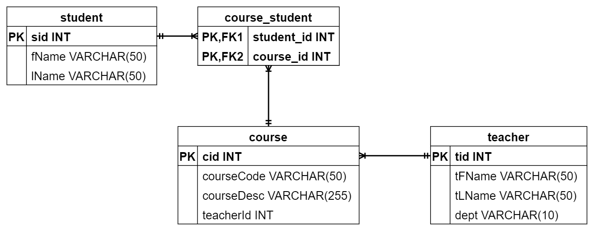

# Database Information

The database for this assignment is embedded in the code provided in the GitHub Classroom repository, so you do not need to set up the database for use with this assignment. 

This page includes details about the database used in this assignment.

* [Database Diagram](#database-diagram)
* [Data Tables](#data)
  * [course](#course)
  * [course_student](#course_student)
  * [student](#student)
  * [teacher](#teacher)

### Database Diagram

The ERD includes the following tables:

- table: student
  - **PK: sid int**
  - fName varchar(50)
  - lName varchar(50)
- table: course_student
  - **PK, FK1: student_id int**
  - **PK, FK2: course_id int**
- table: course
  - **PK: cid int**
  - courseCode varchar(50)
  - courseDesc varchar(50)
  - teacherId int
- table: teacher
  - **PK: tid int**
  - tFName varchar(50)
  - tLName varchar(50)
  - dept varchar(10)

The ERD contains the following relationships:

- a one-to-many relationship between student and course_student
- a one-to-many relationship between course and course_student
- a one-to-many relationship between teacher and course

**[Back to top](#database-information)**

### Data Tables

The data tables are listed below.

#### course

| cid  | courseName | courseDesc                          | teacherId |
| ---- | ---------- | ----------------------------------- | --------- |
| 1    | CS148      | Intro to Data Structures            | 1         |
| 2    | CS100      | Intro to Java                       | 2         |
| 3    | CS202      | Intermediate Java                   | 1         |
| 4    | CS305      | Advanced Python                     | 5         |
| 5    | CS407      | Information Systems Management      | 4         |
| 6    | CS206      | Network Design                      | 4         |
| 7    | CS503      | Advanced Cyber Security             | 3         |
| 8    | CS326      | Advanced Fortran                    | 5         |
| 10   | CS324      | Advanced Web Services with Java API | 3         |
| 11   | EN220      | Fictional Writing                   | 10        |
| 12   | EN250      | Fantasy Fictional Writing           | 11        |
| 14   | EN100      | Writing Basics                      |           |
| 15   | EN200      | English Composition                 |           |
| 16   | EN300      | Poetry Writing                      |           |

**[Back to top](#database-information)**

#### course_student

| student_id | course_id |
| ---------- | --------- |
| 1          | 1         |
| 1          | 2         |
| 2          | 1         |
| 2          | 2         |
| 2          | 3         |
| 1          | 3         |
| 1          | 5         |
| 2          | 4         |
| 2          | 6         |
| 3          | 2         |
| 3          | 3         |
| 3          | 4         |
| 3          | 5         |
| 4          | 1         |
| 4          | 4         |
| 4          | 5         |
| 4          | 6         |
| 4          | 7         |
| 5          | 1         |
| 5          | 2         |
| 5          | 4         |
| 5          | 6         |
| 6          | 1         |
| 6          | 3         |
| 6          | 5         |
| 6          | 6         |
| 6          | 7         |
| 7          | 1         |
| 7          | 2         |
| 7          | 3         |
| 7          | 5         |
| 7          | 6         |
| 7          | 7         |
| 9          | 3         |
| 9          | 5         |
| 9          | 6         |
| 9          | 7         |

**[Back to top](#database-information)**

#### student

| sid  | fName   | lName       |
| ---- | ------- | ----------- |
| 1    | Jolene  | Westcott    |
| 2    | Tabby   | Daniell     |
| 3    | Hans    | Wozniak     |
| 4    | Ifeanyi | Derichs     |
| 5    | Guafrid | Lopez       |
| 6    | Helena  | Abbandonato |
| 7    | Aime    | Larsen      |
| 9    | Milada  | Dreher      |

**[Back to top](#database-information)**

#### teacher

| tid  | tFName   | tLName   | dept             |
| ---- | -------- | -------- | ---------------- |
| 1    | Hedy     | Lamarr   | Computer Science |
| 2    | Radia    | Perlman  | Computer Science |
| 3    | Annie    | Easley   | Computer Science |
| 4    | Peter    | Denning  | Computer Science |
| 5    | Ravi     | Sethi    | Computer Science |
| 7    | Hilary   | Mantel   | English          |
| 8    | Margaret | Atwood   | English          |
| 9    | David    | Mitchell | English          |
| 10   | Michael  | Chabon   | English          |
| 11   | Neil     | Gaiman   | English          |

**[Back to top](#database-information)**
